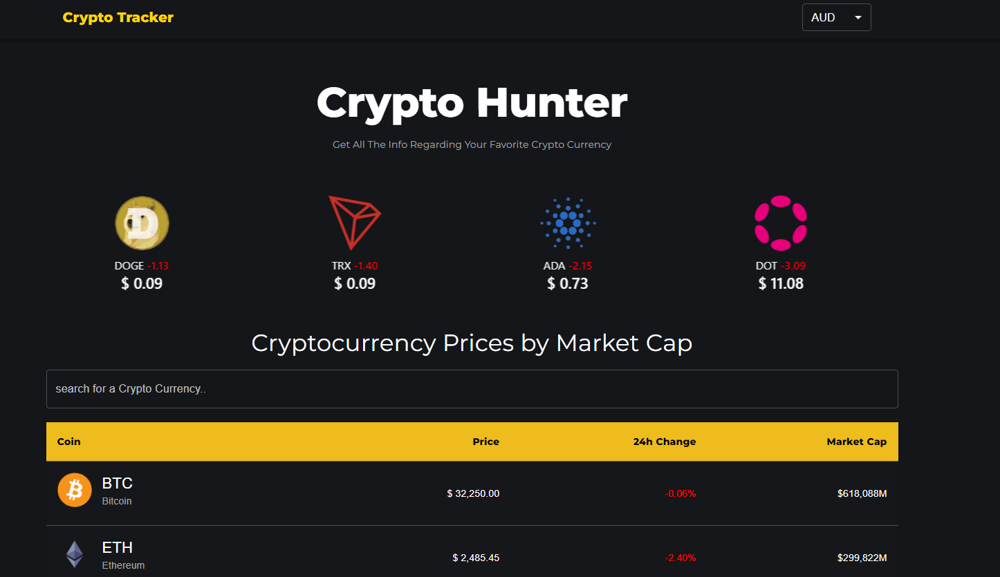
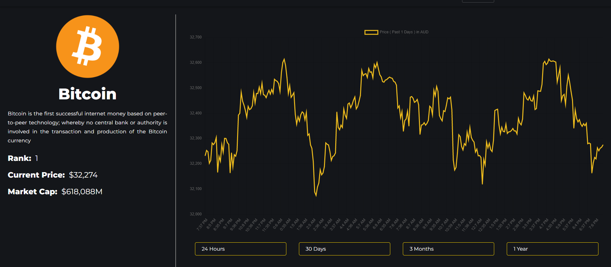

# crypto-tracker

Web application built with REACT framework of JS, where individual can see the historical data of crypto currency based on different duration.

# Functionality of this app

- Platform to allow users to have Current price, Market Cap and historical data of the crypto currency.

# Installation

- to run in locally for education purpose
- Download or clone repository.
- Node.js is required to run the application
- npm install to install the required packages as per package.json

# Usage

- use the following link to open the application
- The application will run on any browser.

# live application

[CRYPTO TRACKER](https://kartavya99.github.io/crypto-tracker/)

# Below are the sample pages of command line application

## Home Page

## Single Coin Page

# Features and Technologies uses

- JavaScript
- React.js
- Material UI
- Node.js

## Under the MIT license

